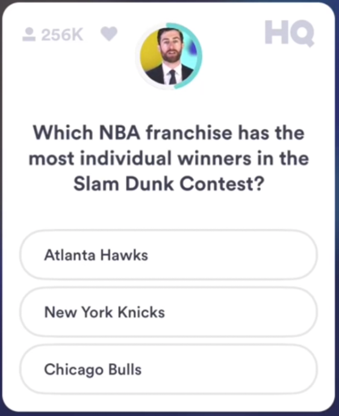

# HQ Bot
An easy way to cheat the popular trivia game using Google Cloud Vision OCR.

# How it works:
1. Use Google OCR to parse out Q&A fields
2. Create a search query in the style: Question? "answer 1"
3. Find the number of results for that query
4. The answer is usually the query with the most results (biggest number in output)

# How to run
1. Get credentials (API Key for Cloud Vision OCR, service account key json file)
2. Create an automator script like so and place in the same directory
___
##### ITEM 1: Run shell script
cd /PATH/TO/DIRECTORY

rm bots.png

##### ITEM 2: Take screenshot
- Interactive
- Choose selection
- Save to /PATH/TO/DIRECTORY/bots.png

##### ITEM 3: Run shell script
cd /PATH/TO/DIRECTORY

export GOOGLE_APPLICATION_CREDENTIALS=[Path to service account key.json]

/path/to/python/interpreter runner.py

##### ITEM 4: View results
___
3. Run script, hit OK on prompt for screenshot. SS everything below phone carrier info and above 'view comments'. Sample included below.

4. Profit

###### Scott's face right now
